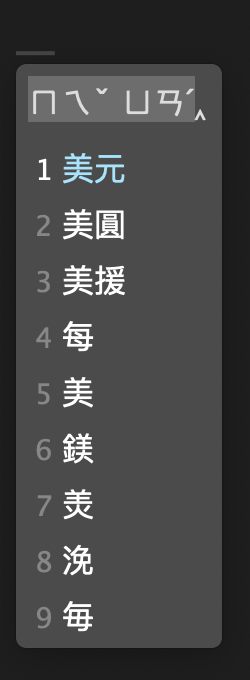

# Rime Themes Collection



## Install with Recipes (依配方安裝)

執行 [東風破](https://github.com/rime/plum) 的 `rime-install` 命令安裝以下配方：

- **℞ `RimeOnion/themes`**

  安裝 mritd 主題樣式

  ```bash
  bash rime-install RimeOnion/themes:apply:theme=mritd
  ```

- **℞ `RimeOnion/themes:apply:theme=mritd,frontend=weasel`**

  指定「小狼毫」使用該主題樣式

  ```bash
  bash rime-install RimeOnion/themes:apply:theme=mritd,frontend=weasel
  ```

- **℞ `RimeOnion/themes:apply:theme=mritd,frontend=squirrel`**

  指定「鼠鬚管」使用該主題樣式

  ```bash
  bash rime-install RimeOnion/themes:apply:theme=mritd,frontend=squirrel
  ```
